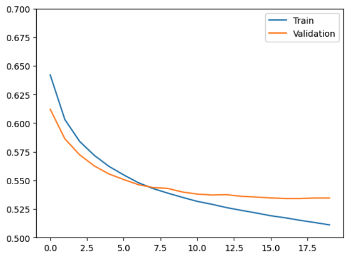

# Sentiment anlaysis - Sarcasm detection in Reddit posts

This repository contains a complete deep learning pipeline for sentiment analysis with a focus on sarcasm detection in Reddit posts. It includes implementations of both classical and modern machine learning models:

- **SGD Classifier** (Scikit-learn)
- **Bi-directional LSTM**
- **Custom Transformer Encoder**
- **Transfer Learning with DeBERTa v3 (Hugging Face)**

All development was conducted in [Google Colab](https://colab.research.google.com/drive/15iZQnqvSXk87S-Ozw3PKBM6qHr8A74PM#scrollTo=d-Q4HB1C20Ds) due to local hardware limitations. Later, the codebase was modularized and tested for portability.


## Dataset

- Source: [Kaggle - Sarcasm Detection Dataset](https://www.kaggle.com/datasets/danofer/sarcasm)
- Balanced Reddit dataset including:
  - Post text
  - Author scores
  - Timestamps
  - Labels (sarcastic / non-sarcastic)
  - Parent comments

**Split:**
- 1M total samples  split into 800K train / 100K validation / 100K test

Initial correlation analyses between features and sarcasm labels revealed that **only the main comment and parent comment were useful** for classification.

---

## Model Performance Summary

| Model                         | Input Used                         | Accuracy |  Notes                                                            |
|------------------------------|-------------------------------------|----------|-------------------------------------------------------------------|
| **SGD Classifier (TF-IDF)**  | Main comment                        | 67.16%   | Classical baseline using TF-IDF; fast but limited context handling|
| **Bi-LSTM**                  | Main comment                        | 72.91%   | Custom vectorizer + simple LSTM; strong trade-off of speed vs. accuracy |
| **Bi-LSTM (Dual Input)**     | Main + parent comment               | 73.61%   | Context-aware; better than using main comment alone                   |
| **Bi-LSTM + Emojis**         | Main + parent + emoji-aware vocab   | ~74.5%   | Slight improvement; kept emojis for future scalability                |
| **Custom Transformer**       | Main + parent (with `[SEP]` token)  | 70.00%   | High training cost; didnt' outperform LSTM due to data limitations |
| **DeBERTa (Frozen)**         | Main + parent                       | 57.8%    | All layers frozen; underfitting likely                                |
| **DeBERTa (Half Frozen)**    | Main + parent (small data)          | 76.0%    | Strong improvement from partial unfreezing                            |
| **DeBERTa (Half + 800K)**    | Main + parent (full data)           | **78.0%**| Best accuracy, but long training time (1+ day)                        |

--- 

## Project Structure

```bash
|-- configs/              # Config files to setup models and training
|-- src/                  # main folder w
    |-- dataset/           # Datset processor and vectoriser script 
    |-- lr_shedule/        # contains custom WarmupCosine LR sheduler script 
    |-- models/            # model definitions 
    |-- trainer/           # Training script
    |-- callbacks.py
    |-- data_process.py
    |-- metrics.py
    |-- utils.py          # Helper functions (vectorizers, metrics, etc.)
|-- train.py             # training function (used config as input to choose the model and perform the trainig)
|-- README.md             # Project overview
```


---
## Models & Results

### Model 1: SGD Classifier (TF-IDF)
Following the [Scikit-learn ML Cheat Sheet](https://scikit-learn.org/stable/tutorial/machine_learning_map/index.html), a TF-IDF vectorizer was used to encode text, and an SGDClassifier was applied.

**Results:**
- Accuracy: **67.16%**
- Precision: 68.87%
- Recall: 67.16%
- F1 Score: 66.38%


### Model 2: Bi-directional LSTM model 

#### Preprocessing:
- Custom vectorizer (similar to TensorFlow's TextVectorization)
- Vocabulary built from training data
- Padding applied to match `max_len` (max_len was found as 98 percentile of len of the trianing data)

#### Architecture:
- Embedding layer -->  Bi-directional LSTM --> Linear layer with Dropout
- Loss: CrossEntropy
- Optimizer: Adam (lr = `1e-4`, weight decay = `1e-5`)

**Result:**  
Validation Accuracy: **72.91%**

#### Enhancements:
1. **Emoji Vocabulary:** Added basic emojis to vocabulary --> +1% accuracy (kept for future use).
2. **Contextual Input:** Combined main + parent comments. Two parallel Bi-LSTMs processed each, followed by concatenation --> Accuracy improved to **73.61%**
3. **GloVe Embeddings:** Tried but yielded no improvement, likely due to Reddit's  (or general posts) unique language structure.

Training/validation loss and accuracy for bi-LSTM model without parent comments 
<p align="center">
  
  
</p>


Training/validation loss and accuracy for bi-LSTM model with parent comments + emojis 
<p align="center">
  
</p>

---

### Model 3: Custom Transformer Encoder

#### Architecture:
- Input: `[main comment] [SEP] [parent comment]`
- Text tokenized with extended vectorizer to include `[SEP]`
- Embedded + positional encodings --> Transformer Encoder block

**Encoder Block:**
- Multi-head self-attention (12 heads)
- 2 encoder layers
- LayerNorm + Dropout + 2 Dense layers (256 units, ReLU activation)

**Training:**
- Optimizer: AdamW (weight decay = `2e-4`)
- Learning rate scheduler: Warmup with cosine decay
- Gradient clipping to prevent exploding gradients

**Result:**  
Validation Accuracy: **70%**  
(Training time: ~5 hours for 20 epochs --> 10x longer than LSTM for lower accuracy)


### Model 4: Transfer Learning with DeBERTa v3 (Hugging Face)

DeBERTa v3 small was used for fine-tuning:

| Strategy                         | Validation Accuracy |
|----------------------------------|---------------------|
| Freeze all layers (small data 100k)   | 57.8% (4epochs)               |
| Freeze half layers (small data 100k)  | 76.0% (4epochs)              |
| Freeze half layers (800K train samples) | **78.0% (1 epoch)** |

While DeBERTa provides the best accuracy, it's significantly more resource-intensive. Training will probably will take a day or two (1 epoch is 4 hours with T4 GPU), and the improvement (~4.5%) over Bi-LSTM may not justify the cost for most applications.

**Recommendation:**  
Unless maximum precision is critical, the Bi-LSTM offers a great trade-off between performance and training efficiency for deployment (20 epochs is 1 hour training)

---


## Future Work
- Hyperparameter optimization for Transformer model
- Experimenting with additional metadata (author score, timestamps)
- Ensemble methods combining classical and neural models
- Deployment-ready export for mobile/real-time usage
